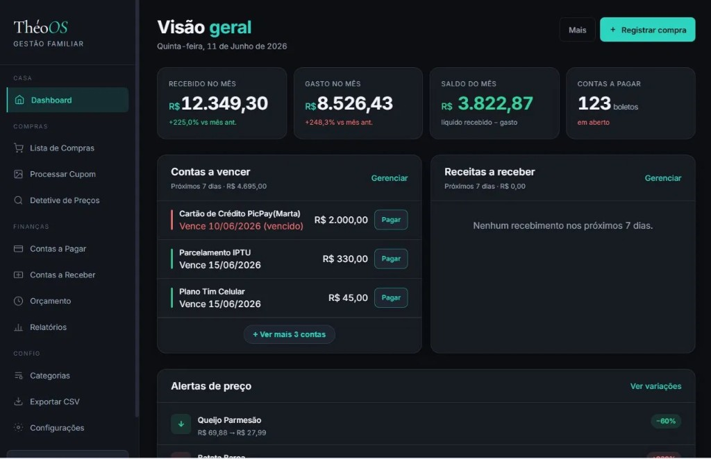

<div align="center">



<br/>

# ThéoOS

**PT:** Sistema operacional doméstico familiar — gestão financeira, compras inteligentes, detetive de preços e alertas via Telegram, tudo com IA.  
**EN:** Family home operating system — financial management, smart shopping, price detective and Telegram alerts, all powered by AI.

<br/>

[](https://python.org)
[](https://flask.palletsprojects.com)
[](https://aistudio.google.com)
[](https://sqlite.org)
[](https://core.telegram.org/bots)
[](LICENSE)
[](https://github.com/simoesleandro/theoos-app/commits)

<br/>

[🐛 Reportar bug](https://github.com/simoesleandro/theoos-app/issues) &nbsp;·&nbsp;
[💡 Sugerir feature](https://github.com/simoesleandro/theoos-app/issues)

</div>

---

## 📋 Índice / Table of Contents

- [Sobre](#-sobre--about)
- [Funcionalidades](#-funcionalidades--features)
- [Stack](#-stack)
- [Módulos](#-módulos--modules)
- [Instalação](#-instalação--setup)
- [Variáveis de Ambiente](#-variáveis-de-ambiente--environment-variables)
- [Arquitetura](#-arquitetura--architecture)
- [Roadmap](#-roadmap)
- [Autor](#-autor--author)

---

## 📌 Sobre / About

**PT:**  
ThéoOS é um sistema doméstico familiar que centraliza gestão financeira, controle de compras e monitoramento de preços em um dashboard Flask. Usa Gemini Vision para ler cupons fiscais automaticamente, detecta variações de preço em produtos do mercado e envia alertas via Telegram. Roda como serviço Windows 24/7 via WinSW.

**EN:**  
ThéoOS is a family home system that centralizes financial management, shopping control and price monitoring in a Flask dashboard. Uses Gemini Vision to automatically read grocery receipts, detects price variations in supermarket products and sends alerts via Telegram. Runs as a Windows service 24/7 via WinSW.

---

## ✨ Funcionalidades / Features

- ✅ **Dashboard financeiro** — receitas, gastos, saldo e contas a pagar do mês
- ✅ **Contas a vencer** — alerta de boletos e vencimentos próximos
- ✅ **Leitura de cupom fiscal** — Gemini Vision extrai itens e valores automaticamente
- ✅ **Detetive de preços** — detecta variações de preço em produtos ao longo do tempo
- ✅ **Alertas de preço** — notificação quando produto cai de preço
- ✅ **Lista de compras** — gestão colaborativa familiar
- ✅ **Contas a receber** — controle de receitas futuras
- ✅ **Orçamento** — planejamento mensal por categoria
- ✅ **Relatórios** — histórico financeiro com export CSV
- ✅ **Alertas Telegram** — notificações automáticas de vencimentos e preços
- ✅ **Serviço Windows** — roda 24/7 via WinSW na porta 5000

---

## 🛠 Stack

| Camada | Tecnologia |
|--------|------------|
| Backend | Python 3.11+ · Flask · Waitress |
| Frontend | HTML/CSS/JS vanilla · dark theme |
| Banco | SQLite local |
| IA | Gemini 2.5 Flash Vision (leitura de cupons) |
| Notificações | Telegram Bot API |
| Deploy | WinSW (serviço Windows) · porta 5000 |

---

## 📦 Módulos / Modules

| Módulo | O que faz |
|--------|-----------|
| **Dashboard** | KPIs financeiros do mês — recebido, gasto, saldo, boletos |
| **Lista de Compras** | Gestão colaborativa de itens a comprar |
| **Processar Cupom** | Upload de foto do cupom → Gemini Vision extrai itens automaticamente |
| **Detetive de Preços** | Histórico de preços por produto — detecta altas e baixas |
| **Contas a Pagar** | Calendário de vencimentos com alertas |
| **Contas a Receber** | Controle de receitas esperadas |
| **Orçamento** | Planejamento mensal por categoria |
| **Relatórios** | Histórico financeiro com export CSV |
| **Categorias** | Gestão de categorias de gastos |
| **Configurações** | Preferências do sistema e integrações |

---

## 🚀 Instalação / Setup

### Pré-requisitos / Prerequisites

- Python 3.11+
- Chave Gemini (gratuita em [aistudio.google.com](https://aistudio.google.com))
- Bot Telegram (opcional — para alertas)

### Instalação / Installation

```bash
# Clone o repositório
git clone https://github.com/simoesleandro/theoos-app
cd theoos-app

# Instale as dependências
pip install -r requirements.txt

# Configure as variáveis de ambiente
cp .env.example .env
# Edite .env com suas chaves

# Rode o projeto
python app.py
# → http://localhost:5000
```

---

## 🔐 Variáveis de Ambiente / Environment Variables

| Variável | Descrição | Padrão |
|----------|-----------|--------|
| `GEMINI_API_KEY` | Gemini Vision (leitura de cupons) | — |
| `TELEGRAM_BOT_TOKEN` | Bot Telegram (alertas) | — |
| `TELEGRAM_CHAT_ID` | Chat ID destino | — |
| `DB_PATH` | Caminho do SQLite | `data/theoos.db` |
| `PORT` | Porta do servidor | `5000` |

> Lista completa em: [`.env.example`](.env.example)

---

## 🏗 Arquitetura / Architecture

```
theoos-app/
├── app.py                 # Entry point Flask (:5000)
├── routes/                # Rotas por módulo
│   ├── dashboard.py       # KPIs financeiros
│   ├── compras.py         # Lista de compras
│   ├── cupom.py           # Leitura de cupom fiscal
│   ├── precos.py          # Detetive de preços
│   ├── financeiro.py      # Contas a pagar/receber
│   └── relatorios.py      # Relatórios e export
├── services/
│   ├── gemini_vision.py   # Extração de itens via Gemini
│   └── telegram.py        # Notificações
├── db/                    # SQLite + schema
├── static/                # UI web
└── theoos-service.xml     # WinSW — serviço Windows
```

**Fluxo do cupom fiscal:**

```
Foto do cupom (upload)
      ↓
Gemini Vision extrai itens, quantidades e valores
      ↓
Itens salvos no banco com data e estabelecimento
      ↓
Detetive de Preços detecta variações vs histórico
      ↓
Alerta Telegram se preço subiu ou caiu
```

---

## 🪟 Serviço Windows (WinSW)

```bash
# Instalar como serviço Windows
theoos-service.exe install
theoos-service.exe start
# → roda 24/7 em background na porta 5000
```

---

## 🗺 Roadmap

- [x] Dashboard financeiro com KPIs do mês
- [x] Leitura automática de cupom fiscal via Gemini Vision
- [x] Detetive de preços com histórico
- [x] Alertas Telegram de vencimentos e preços
- [x] Serviço Windows 24/7 via WinSW
- [x] Export CSV de relatórios
- [ ] App mobile (PWA)
- [ ] Integração com banco digital (Open Finance)
- [ ] OCR offline para cupons sem internet

---

## 👤 Autor / Author

<div align="center">

**Leandro Simões**

> *Projeto nomeado em homenagem ao Théo* 💙

[](https://linkedin.com/in/leandro-sim%C3%B5es-7a0b3537b)
[](https://github.com/simoesleandro)
[](https://simoesleandro.github.io/portfolio)

*Fullstack · IA Aplicada · Civic Tech*

</div>

---

<div align="center">

Feito com ☕ e IA em / Made with ☕ and AI in 🇧🇷 Rio de Janeiro

</div>
